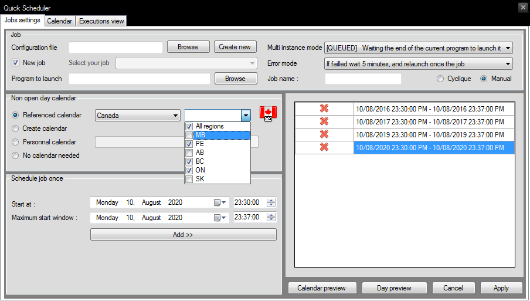
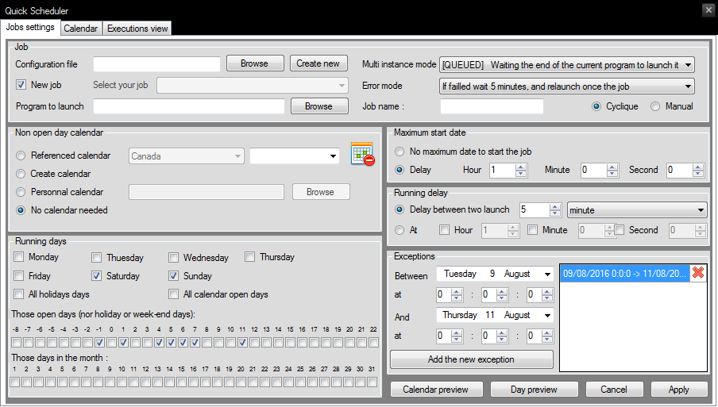
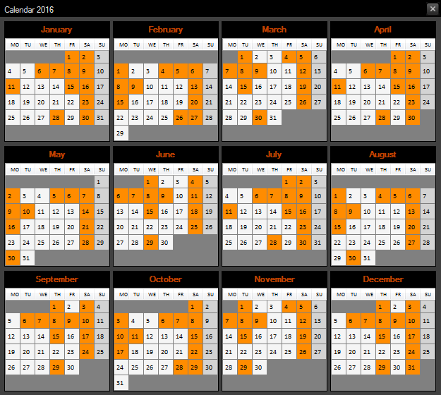

# Manager-Scheduler

Scheduling jobs, and monitoring them. There is a module to calculate all publics holidays of all countries.

[Scheduler](https://github.com/ThibaultMontaufray/Manager-Scheduler) [](https://www.nuget.org/packages/Droid_Scheduler/)    [](https://travis-ci.org/ThibaultMontaufray/Manager-Scheduler)  [](https://coveralls.io/github/ThibaultMontaufray/Manager-Scheduler?branch=master)  [](http://servodroid.com:8080/job/CI-Manager-Scheduler/)  [](https://codeclimate.com/github/ThibaultMontaufray/Manager-Scheduler) 

# Launch the demo :

```scharp
Application.Run(new GUI());
```

# Screens of demo :

Scheduling job on fixed date
<p></p>

Scheduling recurent job
<p></p>

Preview job scheduled
<p></p>
